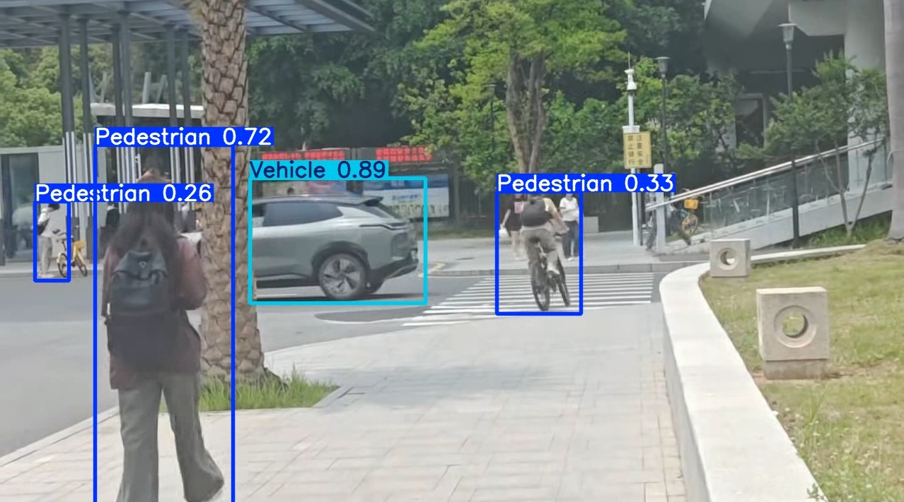

# Pesitation-and-Vehicle-Detection

# 🚗 基于 YOLOv11 的行人与车辆检测

> 深圳大学 人工智能课程实验项目  
> 使用 YOLOv11n 在 CPU 环境下完成行人和车辆目标检测的完整流程（数据获取 → 训练 → 推理）

[](https://www.python.org/)
[](https://github.com/ultralytics/ultralytics)

## 📖 项目简介

本项目基于 **YOLOv11**（You Only Look Once）目标检测算法，实现了对**行人**和**车辆**两类目标的检测。通过 Roboflow 平台获取小型公开数据集，在无 GPU 的普通笔记本电脑上完成了轻量级训练和推理，验证了 YOLOv11 在低配硬件上的可行性。

**实验目的**
- 掌握 YOLOv11 的网络结构与核心改进（C3k2、C2PSA 等）
- 学会使用 Anaconda 虚拟环境 + Ultralytics 框架
- 利用 Roboflow 快速获取标注数据集，无需手工标注
- 在 CPU 环境下进行微调训练，理解超参数影响
- 使用训练好的权重对图片/视频进行推理并评估结果

## ✨ 功能特点

- ✅ 支持行人、车辆（小轿车、公交车、卡车等）检测
- ✅ 提供完整的训练脚本 `train.py` 和推理脚本 `infer.py`
- ✅ 自动下载 YOLOv11n 预训练权重（约 5MB）
- ✅ 支持 CPU/GPU 训练，针对 CPU 优化了 `imgsz` 和 `batch` 参数
- ✅ 训练 10 个 epoch 仅需 30-60 分钟，mAP@0.5 可达约 0.72
- ✅ 推理结果自动保存并显示检测框及置信度

## 🛠️ 环境要求

- 操作系统：Windows 10/11（其他系统也可）
- Python 3.8 - 3.10
- 硬件：无 GPU 亦可（仅 CPU 完成所有操作）

主要依赖库：
- `ultralytics` (YOLOv11 框架)
- `torch` (PyTorch 后端)
- `opencv-python` (图像处理)
- `roboflow` (数据集下载，可选)

## 🚀 快速开始

### 1. 克隆仓库（或直接下载代码）

```bash
git clone https://github.com/Xiaoyi-star/Pesitation-and-Vehicle-Detection.git
cd Pesitation-and-Vehicle-Detection
```

### 2. 创建并激活虚拟环境

打开Anaconda Prompt（或终端），执行：
```bash
conda create -n yolov11 python=3.10 -y
conda activate yolov11
```
### 3. 安装依赖

```
pip install ultralytics
# 如果需要使用 Roboflow 下载数据集，还要安装
pip install roboflow
```

验证安装：
```
python -c "from ultralytics import YOLO; print('安装成功')"
```

### 4. 准备数据集

本实验使用**Roboflow Universe**上的公开数据集（约500张照片，包含行人和车辆标注）。

### 5. 训练模型

编辑`train.py`，确保`data`参数指向正确的`data.yaml`路径，然后运行：
```
python train.py
```
训练完成后，最佳权重保存在`runs/detect/yolo11_vp/weights/best.pt`。

### 6. 推理测试

使用训练好的权重检测自己的图片：
```
python infer.py
```
推理结果图片保存在` runs/detect/ `目录下。


## 📊 实验结果

在 CPU 上训练 10 个 epoch 后的典型指标：

| Epoch | box_loss | cls_loss | mAP@0.5 | mAP@0.5:0.95 |
|-------|----------|----------|---------|---------------|
| 5     | 1.54     | 1.76     | 0.63    | 0.40          |
| 10    | 1.21     | 1.43     | **0.72**| 0.48          |

- **mAP@0.5 = 0.72**：IoU≥0.5 时的平均检测精度，能够有效识别行人和车辆。
- 训练时间约 30-60 分钟（取决于 CPU 性能）。
- 若使用 GPU 或增加 epoch 数，精度可进一步提升。

**推理示例**  
  
*(浅蓝框：车辆，深蓝框：行人)*

## 🧠 YOLOv11 核心改进（与 YOLOv8 对比）

| 模块 | 改进说明 |
|------|----------|
| **C3k2** | 改进的跨阶段局部网络，参数量减少约 22%，更适合 CPU 推理 |
| **C2PSA** | 引入位置敏感注意力机制，提升小目标（远距离行人）检测能力 |
| **统一接口** | 检测、分割、姿态估计共用同一套训练代码 |

## 📁 项目文件结构
见仓库文件夹

## 📝 实验结论

1. 在无 GPU 的普通笔记本上，本实验成功完成了 YOLOv11 的完整训练和推理流程，验证了该框架对低配硬件的兼容性。  
2. Roboflow 提供的数据集有效降低了数据准备门槛，无需手工标注即可快速开始实验。  
3. YOLOv11n 参数量小，CPU 训练 10 个 epoch 后 mAP@0.5 约 0.72，能够有效识别行人、小轿车、公交车和卡车。  
4. 通过调整 `imgsz=416`、`batch=4` 显著缩短了训练时间，证明了超参数优化对低配环境的重要性。  
5. 未来若使用云 GPU 或更大型的预训练权重（如 YOLOv11s），检测精度有望进一步提升。

## 📄 许可证

本项目采用 MIT 许可证。详情见 [LICENSE](LICENSE) 文件。

## 📧 联系方式

- **项目地址**：[https://github.com/Xiaoyi-star/Pesitation-and-Vehicle-Detection](https://github.com/Xiaoyi-star/Pesitation-and-Vehicle-Detection)

---

⭐ 如果这个项目对你有帮助，欢迎点亮 Star！  
🐛 问题反馈请提交 [Issue](https://github.com/Xiaoyi-star/Pesitation-and-Vehicle-Detection/issues)

-*说明：实验中我用的是GPU训练模型。*


